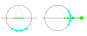

# Curved Space Shader

This vertex shader was first written in HLSL for the Unity game Sfera: [https://bntr.itch.io/sfera](https://bntr.itch.io/sfera).  
Now it's rewritten in GLSL for [three.js](https://threejs.org/).

**Try it interactively:** [https://bntre.github.io/CurvedSpaceShader/](https://bntre.github.io/CurvedSpaceShader/)  

**Watch the demo video:** [https://www.youtube.com/watch?v=yhRXQAb-uh0](https://www.youtube.com/watch?v=yhRXQAb-uh0)

## Math Behind the Effect

To show curved space (see [Spherical Geometry](https://en.wikipedia.org/wiki/Spherical_geometry)), each 3D model goes through a special transformation using 4D rotation and projection.

For each object:

1. The model is scaled and positioned near the center of world space.
2. In the vertex shader:
    - The 3D point is projected onto a 4D unit sphere:  
      \( x^2 + y^2 + z^2 + w^2 = 1 \)
    - A 4D rotation is applied (each object has its own rotation).
    - The point is projected back to 3D using stereographic projection.

## Interactive Controls

**Mouse Wheel**: Zoom  
+ `Ctrl`: Rotate in ZW ("evert")  
+ `Shift`: Rotate in XY (spin)

**Mouse Drag**:  
- `Left Button`: Rotate in XZ/YZ  
  + `Ctrl`: Rotate in XW/YW ("evert")  
  + `Shift`: Scale objects in world space
- `Right Button`: Rotate in XY (spin)  
- `Middle Button`: Move the girl in world space

**Keyboard**:  
- `Space`: Pause girl animation  
- `Arrow Keys`: Fly camera  
- `End`: Stop flying  
- `Home`: Reset scene

## Credits

- Animated models from three.js examples  
    (the models are not included in this repo; they are loaded at runtime from the three.js repository):
  - [Michelle](https://threejs.org/examples/?#webgpu_skinning) by Mixamo
  - [Horse](https://threejs.org/examples/?#webgl_morphtargets_horse) by Mirada

- Music: *Backbeat* by Kevin MacLeod (CC0)
